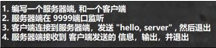
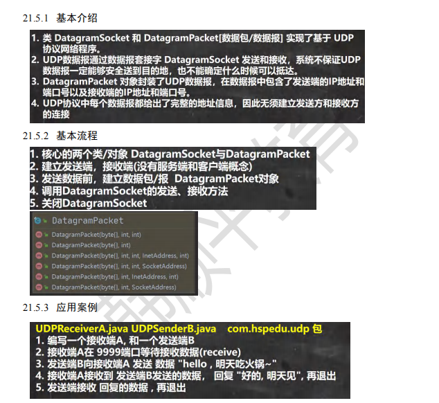

-- TCP网络通信协议
-- 字节流

-- 字符流
客户端连接到服务端,发送"hello-world",并接受服务端回发的"hello,client",再退出;
服务端接收到客户端发送的信息,输出,并发出"hello,client"再退出;

-- UDP网络通信协议

https://bright-boy.gitee.io/technical-notes/#/%E7%BD%91%E7%BB%9C%E7%BC%96%E7%A8%8B/socket?id=%e7%bb%bc%e5%90%88%e7%bb%83%e4%b9%a0
